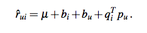
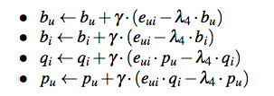

librec是基于java的优秀的推荐系统库，学习librec有助于很好的理解经典的推荐算法。

## 基础

### 数据结构：

#### DensenMatrix Class
    rowMult(DenseMatrix m, int mrow, DenseMatrix n, int nrow)函数
    * @param m    the first matrix
    * @param mrow row of the first matrix
    * @param n    the second matrix
    * @param nrow row of the second matrix
    * @return inner product of two row vectors
    
    用于预测r
    
    

## 算法：

### BiasedMFRecommender
参考论文：Koren Y, Bell R, Volinsky C. Matrix factorization techniques for recommender systems[J]//Computer, 2009

这篇论文偏综述性，不太技术性，主要综述矩阵分解技术在推荐系统中的应用。

BiasedMFRecommender 的实现，虽然Librec官方给出的是参考上述论文，但是实际上代码实现知识最基础的SVD方法。

评分由下面规则得到：

学习模型参数，最小化下面正则化平方差：

使用梯度更新计算：

对应代码：BiasedMFRecommender  中 line83-99  中trainModel()函数

