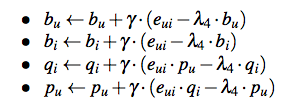
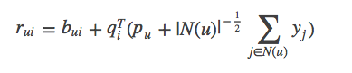

librec是基于java的优秀的推荐系统库，学习librec有助于很好的理解经典的推荐算法。

## 基础

### 数据结构：

#### DensenMatrix Class
    rowMult(DenseMatrix m, int mrow, DenseMatrix n, int nrow)函数
    * @param m    the first matrix
    * @param mrow row of the first matrix
    * @param n    the second matrix
    * @param nrow row of the second matrix
    * @return inner product of two row vectors
    
    用于预测r
    
    

## 算法：

### BiasedMFRecommender
参考论文：[Koren Y, Bell R, Volinsky C. Matrix factorization techniques for recommender systems[J]//Computer, 2009](http://ieeexplore.ieee.org/stamp/stamp.jsp?arnumber=5197422&tag=1)

这篇论文偏综述性，不太技术性，主要综述矩阵分解技术在推荐系统中的应用。

BiasedMFRecommender 的实现，虽然Librec官方给出的是参考上述论文，但是实际上代码实现知识最基础的SVD方法。

评分由下面规则得到：


学习模型参数，最小化下面正则化平方差：


使用梯度更新计算：



对应代码：BiasedMFRecommender  中 line83-99  中trainModel()函数

```java
    double userBiasValue = userBiases.get(userIdx);
    userBiases.add(userIdx, learnRate * (error - regBias * userBiasValue));
    loss += regBias * userBiasValue * userBiasValue;

    double itemBiasValue = itemBiases.get(itemIdx);
    itemBiases.add(itemIdx, learnRate * (error - regBias * itemBiasValue));
    loss += regBias * itemBiasValue * itemBiasValue;

    //update user and item factors
    for (int factorIdx = 0; factorIdx < numFactors; factorIdx++) {
        double userFactorValue = userFactors.get(userIdx, factorIdx);
        double itemFactorValue = itemFactors.get(itemIdx, factorIdx);

        userFactors.add(userIdx, factorIdx, learnRate * (error * itemFactorValue - regUser * userFactorValue));
        temFactors.add(itemIdx, factorIdx, learnRate * (error * userFactorValue - regItem * itemFactorValue));
        loss += regUser * userFactorValue * userFactorValue + regItem * itemFactorValue * itemFactorValue;
    }
```
### SVDPlusPlusRecommender

参考论文：[Koren Y. Factorization meets the neighborhood: a multifaceted collaborative filtering model[C]//KDD. 2008
](http://dl.acm.org/citation.cfm?id=1401944)

SVDPlusPlusRecommender 实现了经典的SVD++ 模型，SVD++ 模型的核心思想是在SVD 模型的基础之上加上用户的 implicit 反馈的信息。

预测公式为：



更新过程为：


### ASVDPlusPlusRecommender
参考论文：[Koren Y. Factorization meets the neighborhood: a multifaceted collaborative filtering model[C]//KDD. 2008
](http://dl.acm.org/citation.cfm?id=1401944)

在推荐系统中，协同过滤（CF：Collaborative Filtering）算法由于其领域无关性以及比较好的推荐效果被广泛使用； 
CF模型比较常用的包括最近邻方法和因子分解算法，由于这两种算法各有优缺点；该文提出了一种策略将这两种方法进行综合建模，并且可以适用于隐式反馈数据。

#### 最近邻方法：

CF常用的有user_based和item_based两个模型，后者由于其推荐效果和可解释性比较强，比较被推荐使用。 
item_based方法思路是根据用户个人偏好推荐和这些item最相关的物品。过程如下：
1. 根据用户和物品的打分矩阵或者相关数据，计算物品两两之间的相似度s(i,j)，常用相似度算法包括皮尔逊系数、jaccard系数。
2. 通常情况下相似度计算可能需要大量数据支持，对于稀疏数据需要对数据规模进行置信度加权，常用加权方法可以是。
3. 用户对某物品打分公式为，其中bui为基准推荐模型，计算公式为，即全局偏置+用户偏置+物品偏置；Ski;u表示在用户关注的物品集合中和物品i最相似的前K个。
4. 另外为了进一步刻画效果，可以通过下面方式进行改进更和用户相关。

#### 因子分解模型

传统的因子分解模型（SVD模型）解析见上述。

svd++模型：


#### 新模型（SVD++ 结合 neighborhood模型）

上述模型存在的问题：

1.最近邻方法根据用户已经打分过的物品，计算和这些物品最相似的物品，相当于一个局部最优问题，没有考虑全局。由于一个用户关注的物品是有限的。

2.因子分解模型可以得到一个全局表示，可解释性不好。


本文参考：
[ 【每周一文】Factorization Meets the Neighborhood：a Multifaceted Collaborative Filtering Model](http://blog.csdn.net/fangqingan_java/article/details/50762296)

