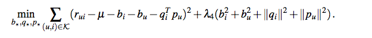
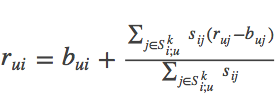
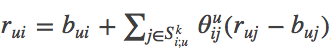

librec是基于java的优秀的推荐系统库，学习librec有助于很好的理解经典的推荐算法。


## 算法：

### BiasedMFRecommender
参考论文：[Koren Y, Bell R, Volinsky C. Matrix factorization techniques for recommender systems[J]//Computer, 2009](http://ieeexplore.ieee.org/stamp/stamp.jsp?arnumber=5197422&tag=1)

这篇论文偏综述性，不太技术性，主要综述矩阵分解技术在推荐系统中的应用。

BiasedMFRecommender 的实现，虽然Librec官方给出的是参考上述论文，但是实际上代码实现知识最基础的SVD方法。

评分由下面规则得到：


学习模型参数，最小化下面正则化平方差：



使用梯度更新计算：


对应代码：BiasedMFRecommender.java  中 line83-99  中trainModel()函数

```java
    double userBiasValue = userBiases.get(userIdx);
    userBiases.add(userIdx, learnRate * (error - regBias * userBiasValue));
    loss += regBias * userBiasValue * userBiasValue;

    double itemBiasValue = itemBiases.get(itemIdx);
    itemBiases.add(itemIdx, learnRate * (error - regBias * itemBiasValue));
    loss += regBias * itemBiasValue * itemBiasValue;

    //update user and item factors
    for (int factorIdx = 0; factorIdx < numFactors; factorIdx++) {
        double userFactorValue = userFactors.get(userIdx, factorIdx);
        double itemFactorValue = itemFactors.get(itemIdx, factorIdx);

        userFactors.add(userIdx, factorIdx, learnRate * (error * itemFactorValue - regUser * userFactorValue));
        temFactors.add(itemIdx, factorIdx, learnRate * (error * userFactorValue - regItem * itemFactorValue));
        loss += regUser * userFactorValue * userFactorValue + regItem * itemFactorValue * itemFactorValue;
    }
```
### SVDPlusPlusRecommender

参考论文：[Koren Y. Factorization meets the neighborhood: a multifaceted collaborative filtering model[C]//KDD. 2008
](http://dl.acm.org/citation.cfm?id=1401944)

SVDPlusPlusRecommender 实现了经典的SVD++ 模型，SVD++ 模型的核心思想是在SVD 模型的基础之上加上用户的 implicit 反馈的信息。

对SVD模型的改进：
加入用户的间接反馈，其中参数qi,xj,yj都是物品在低维空间中的表示。 主要思路是将用户表示为其相关物品向量的累加。 
1.更少的参数，模型仅和物品有效个数相关，一般情况下用户个数会更多。 好处：
2.对于新用户可以解决冷启动问题，用户表示直接通过用户点击的物品得到
3.可解释性相对于原始模型较强
4.可以更有效的集成隐式反馈数据，可以通过调整隐式向量系数得到。
这个模型被称为"Asymmetric-SVD"


在实际应用中，并没有足够的间接反馈信息，进行一些简化效果更好一些，SVD++ 模型针对上述模型进行简化：


对应SVDPlusPlusRecommender.java 中 line135-153

```java
protected double predict(int userIdx, int itemIdx) throws LibrecException {
        double predictRating = userBiases.get(userIdx) + itemBiases.get(itemIdx) + globalMean;

        List<Integer> items = userItemsList.get(userIdx);
        DenseVector userImpFactor = new DenseVector(numFactors);

        // sum of implicit feedback factors of userIdx with weight Math.sqrt(1.0 / userItemsList.get(userIdx).size())
        for (int impItemIdx : items) {
            userImpFactor.addEqual(impItemFactors.row(impItemIdx, false));
        }

        double impNor = Math.sqrt(items.size());
        if (impNor > 0) {
            userImpFactor.scaleEqual(1.0 / impNor);
        }
        // sum with user factors
        userImpFactor.addEqual(userFactors.row(userIdx, false));

        return predictRating + userImpFactor.inner(itemFactors.row(itemIdx, false));
}
```
更新过程为：


对应SVDPlusPlusRecommender.java 中 train() 代码略去。


### ASVDPlusPlusRecommender
参考论文：[Koren Y. Factorization meets the neighborhood: a multifaceted collaborative filtering model[C]//KDD. 2008
](http://dl.acm.org/citation.cfm?id=1401944)

在推荐系统中，协同过滤（CF：Collaborative Filtering）算法由于其领域无关性以及比较好的推荐效果被广泛使用； 
CF模型比较常用的包括最近邻方法和因子分解算法，由于这两种算法各有优缺点；该文提出了一种策略将这两种方法进行综合建模，并且可以适用于隐式反馈数据。

#### 最近邻方法：

CF常用的有user_based和item_based两个模型，后者由于其推荐效果和可解释性比较强，比较被推荐使用。 
item_based方法思路是根据用户个人偏好推荐和这些item最相关的物品。过程如下：
1. 根据用户和物品的打分矩阵或者相关数据，计算物品两两之间的相似度s(i,j)，常用相似度算法包括皮尔逊系数、jaccard系数。
2. 通常情况下相似度计算可能需要大量数据支持，对于稀疏数据需要对数据规模进行置信度加权，常用加权方法可以是。
3. 用户对某物品打分公式为，其中bui为基准推荐模型，计算公式为，即全局偏置+用户偏置+物品偏置；Ski;u表示在用户关注的物品集合中和物品i最相似的前K个。
4. 另外为了进一步刻画效果，可以通过下面方式进行改进更和用户相关。

对最邻近模型的改进：

改进一：

以item_based方法为例，之前item之间的相似度都是通过数据统计得到，现在变成模型参数通过模型训练得到，即

和之前不同点包括： 
1. Item之间的相似度通过学习得到 
2. 通过搜索用户所有相关的物品得到最后打分，而不是前K个 
3. 模型wij(ruj−buj)综合考虑了用户到已有物品j的喜好程度以及物品j到物品i的相关度

改进二：

另外可以将隐式数据加入到模型中，则模型变为:


其中N(u)为隐式反馈数据中用户u相关的物品集合

改进三：

用户偏置项也可以通过模型学习得到，而不是统计得到，即都设置为模型参数，通过学习得到，这样可以进一步去除用户和物品偏置，这样更容易推荐长尾数据。

改进四：

为了解决模型中参数两级分化问题，对邻域个数进行归一，即:


为了降低复杂度可以提前去除一些不相关的物品集合，即定义R_k=R(u)∩S_k(i)去代替全部邻域数据

#### 因子分解模型

传统的因子分解模型（SVD模型 SVD++模型）解析见上述。

#### 新模型（SVD++ 结合 neighborhood模型）

上述模型存在的问题：

1.最近邻方法根据用户已经打分过的物品，计算和这些物品最相似的物品，相当于一个局部最优问题，没有考虑全局。由于一个用户关注的物品是有限的。

2.因子分解模型可以得到一个全局表示，可解释性不好。

于是这篇文章的作者提出，结合两种方法。

最终模型为：


相当于将三层模型进行累加 
1. 第一层模型：基准模型 
2. 第二层模型：因子分解模型，会考虑到全局用户和物品画像 
3. 第三层模型：最近邻模型，会考虑到用户本身偏置特征。


本节参考：
[ 【每周一文】Factorization Meets the Neighborhood：a Multifaceted Collaborative Filtering Model](http://blog.csdn.net/fangqingan_java/article/details/50762296)


### TimeSVDRecommender

参考论文：[Koren Y. Collaborative filtering with temporal dynamics[J]. Communications of the ACM, 2010, 53(4): 89-97.](http://citeseerx.ist.psu.edu/viewdoc/download?doi=10.1.1.379.1951&rep=rep1&type=pdf)


