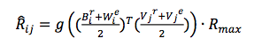
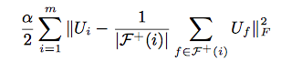
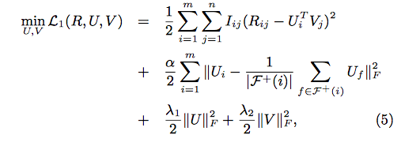
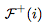
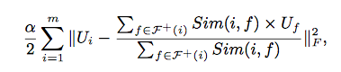
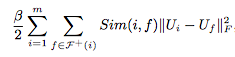

本文结合librec源代码，总结一些结合Social信息的相关推荐系统模型


### TrustMFRecommender

参考论文:[Yang B, Lei Y, Liu J, et al. Social collaborative filtering by trust[J]//IJCAI 2013.
](http://www.aaai.org/ocs/index.php/IJCAI/IJCAI13/paper/download/6750/7139)

CF方法是推荐系统非常流行的方法，但是它有数据稀疏和冷启动问题，这篇文章精巧的结合了两个稀疏数据源：
用户评分矩阵，和信任网络（trust network）。

这篇文章思想源于，用户在社交网络中的影响是相互的，比如特定用户的评分可能会受他信任的用户的影响，并且他的评分同样会影响其他信任他的用户。
为了对这种思想进行建模，作者提出，用户之间的信任关系，可以映射到向量空间之中，每个用户用两个向量来表示这种关系，分别为truster向量和trustee向量,
用户A对用户B的信任程度为w，可以用用户A的truster向量与用户B的trustee向量内积得到。

传统CF矩阵分解的方法是认为评分矩阵R 由用户因子空间U 和 物品因子空间V（本文使用这种符号）相乘得到，

通过最小化下面的损失函数由 R 得到 U V：


同样地，信任矩阵T（T<sub>i,j</sub> 代表用户i 对用户j 的信任值，因为用户j 可能对用户i 的信任值不同，因此，矩阵T 不是对称的）可以由 用户信任矩阵 B 和 用户被信任矩阵 W
相乘得到。

通过最小化下面的损失函数：


这篇文章提出了三个模型：Truster Model, Trustee Model, Truster-MF，来结合上述的两个矩阵分解。

#### Truster Model

核心思想是 用矩阵 B 结合 用户因子矩阵 U 和 信任矩阵B ，从而把两个矩阵分解问题联系在一起。R 由因子空间B(同时包含用户信息因子和用户信任信息因子) 和 物品因子空间V 相乘得到，
信任矩阵T 由 用户信任矩阵 B（同时包含用户信息因子和用户信任信息因子） 和 用户被信任矩阵 W 相乘得到。
通过最小化下面的损失，得到 B V W：


因为信任矩阵T的取值在[0,1]之间，为了更好地学习模型，这篇文章把R做了正则化处理，也限制在了[0,1]之间，本文没有采取线性放缩，而是采取了logistic function(也具有保证在[0,1]之间的性质)(下式中的g)，因此最小化损失模型变为：


#### Trustee Model

思想与Truster Model 相同，只不过W取代了B在上述模型的位置，最小化下面的损失：


#### Truster-MF

是上述两种模型的结合，先独立训练上述两个模型，然后按照下述公式进行结合；



总结：

这个模型可以从用户的社会行为学习用户的偏好（不只是从评分行为），Truster Model学到了，用户在评分是受别人的影响，Trustee Model学到了，用户的评分对别人的影响，Truster-MF把两者结合，试图给两个用户群都提供高质量的推荐。

librec提供了这三种模型的选择，在predict()函数中可以清楚的看到：

```java
    switch (model) {
        case "Tr":
            predictRating = DenseMatrix.rowMult(trusterUserTrusterFactors, userIdx, trusterItemFactors, itemIdx);
            break;
        case "Te":
            predictRating = DenseMatrix.rowMult(trusteeUserTrusteeFactors, userIdx, trusteeItemFactors, itemIdx);
            break;
        case "T":
        default:
            DenseVector userVector = trusterUserTrusterFactors.row(userIdx).add(trusteeUserTrusteeFactors.row(userIdx, false));
            DenseVector itemVector = trusterItemFactors.row(itemIdx).add(trusteeItemFactors.row(itemIdx, false));
            predictRating = userVector.inner(itemVector) / 4;
    }
```

在代码中可以清晰看到，Truster-MF模型是独立训练两个模型

```java
    protected void trainModel() throws LibrecException {
        switch (model) {
            case "Tr":
                TrusterMF();
                break;
            case "Te":
                TrusteeMF();
                break;
            case "T":
            default:
                TrusterMF();
                TrusteeMF();
        }
    }
```

### TrustSVDRecommender

参考论文：[Guo G, Zhang J, Yorke-Smith N. TrustSVD: Collaborative Filtering with Both the Explicit and Implicit Influence of User Trust and of Item Ratings[C]//Aaai 2015
](https://pdfs.semanticscholar.org/5d29/fd7fdd1323b07a7f6b178253511f0638c998.pdf)

本文在SVD++ 的基础上，认为Social Trust信息也可以像SVD++ 一样，把信任信息的显式信息和隐式信息加入到模型中。同样为了更好的解决CF的两大问题：稀疏性和冷启动。

作者通过观察几个带有Social Trust的数据集，得到了两个观察结论


观察一：信任信息非常稀疏，应当作为评分信息的补充

观察二：用户的评分和他的social neighbor的平均评分在基于 trust-alike 关系的基础下具有弱正相关性，在基于 trust 关系的基础下具有强正相关性

什么是trust-alike 关系，在 FilmTrust 和 Flixster 这两个数据集，信任关系不是特别明确，或者说比 Trust 关系更弱（更noisy）
作者定义这种不是很强的信任关系为Trust-alike 关系。这两个数据的用户评分和他的Social neighbor评分之间的关系均分分别为0.183和
0.063呈现弱相关性，而另外两个数据集分别为0.446和0.322，呈现强相关性，由此得到这个结论。

受SVD++模型启发，作者在模型中，把trust-alike信息当作隐式信息，形式和SVD++相同：


这里的W<sub>v</sub> 是对特定用户v,他被用户u信任的隐因子向量（trustee）。

除了隐式信息，显示信息形式和用户的因子空间共享因子空间，从而架起两个矩阵信息结合的桥梁，形式不变，只是在训练时用到两个矩阵信息联合训练。
t<sub>u,v</sub>_hat =W<sub>v</sub><sup>T</sup> * p<sub>u</sub>得到。 

另外,一种weighted-𝛌-regularization的方法能更有效防止参数过拟合，最小化损失方程为；


参数更新；


### SoRegRecommender

参考论文:[Ma H, Zhou D, Liu C, et al. Recommender systems with social regularization[C]//WSDM 2011](http://dl.acm.org/citation.cfm?id=1935877)

这篇论文提出了一个通用的，考虑social network 信息的，基于矩阵分解的模型，这个模型是social-based模型，它有别于trust-based模型。
方法是，在矩阵分解模型的基础之上，加入了Social 正则化项，通过Social信息，一定程度控制训练过程。

本文social-based方法是有别于trust-based方法的，虽然两者利用的都是social类信息，但是"trust relationships"可能是单向的，有可能用户在社交网络上trust了另一个用户（可能是名人），
但是另一个用户可能不会trust他，而"social friendship"指的一般都是我们的社会关系，例如，同事同学等我们熟悉认识的人，这个关系，一般也是双向的。另外，trust信息，一般是基于用户和他信任的
人有相似的属性的假设，但是social信息并不会，因为我们的朋友不一定就和我们有相同的属性，很可能千差万别。

这篇文章设计了两个Social相关的正则化项，来限制矩阵分解的目标函数，从而达到加入Social信息的目的。传统矩阵分解（SVD）等背景不在赘述，下面直接进入主题，介绍这两种正则化项的思想。

#### Average-based Regularization

这个正则化项的思想是，我们相信我们朋友们的品味，有时，我们为了作出一个决定，会去参考很多朋友的意见，这个正则化项为：



相应的最小化目标函数为：



其中𝜶>0,代表来用户u<sub>i</sub>的朋友集合，+／-代表单项关系（如果关系真的为单项，这个公式等同于trust关系，所以模型的通用的），
如果是social friendship关系，+/-实际是一样的。这个正则化目的是最小化用户和他的朋友之间的差距。考虑到和朋友相似性的差别，应当加入相似性修正项，如下式：



Sim(i,f)很常见了，多用VSS PCC方法，不在赘述。

#### Individual-based Regularization

上一个正则化系数考虑用户和他的朋友们属性的平均值之间的关系，实际上忽略了个体性差异，用户的朋友可能会有非常多样的品味，需要有另一个正则化项来体现这种情况：



原理很简单，根据用户和他的朋友们之间的相似程度，来进行逐个的限制，是的用户不同程度的缩小和朋友之间属性的差异。

代码上，多了这两个在训练过程中的修正：

```java
for (int userIdx = 0; userIdx < numUsers; userIdx++) {
     // out links: F+
    SparseVector userOutLinks = socialMatrix.row(userIdx);

    for (int userOutIdx : userOutLinks.getIndex()) {
        double userOutSim = userSocialCorrs.get(userIdx, userOutIdx);
        if (!Double.isNaN(userOutSim)) {
            for (int factorIdx = 0; factorIdx < numFactors; factorIdx++) {
            double errorOut = userFactors.get(userIdx, factorIdx) - userFactors.get(userOutIdx, factorIdx);
            tempUserFactors.add(userIdx, factorIdx, regSocial * userOutSim * errorOut);

            loss += regSocial * userOutSim * errorOut * errorOut;
            }
        }
    }

    // in links: F-
    SparseVector userInLinks = socialMatrix.column(userIdx);
    for (int userInIdx : userInLinks.getIndex()) {
        double userInSim = userSocialCorrs.get(userIdx, userInIdx);
        if (!Double.isNaN(userInSim)) {
            for (int factorIdx = 0; factorIdx < numFactors; factorIdx++) {
                double errorIn = userFactors.get(userIdx, factorIdx) - userFactors.get(userInIdx, factorIdx);
                tempUserFactors.add(userIdx, factorIdx, regSocial * userInSim * errorIn);

                loss += regSocial * userInSim * errorIn * errorIn;
            }
        }
    }
} // end of for loop

```

