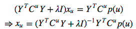

### WRMFRecommender

参考论文:[Hu Y, Koren Y, Volinsky C. Collaborative filtering for implicit feedback datasets[C]//ICDM. 2008
](http://ieeexplore.ieee.org/abstract/document/4781121/)

这篇文章，解决的主要问题是，大多数推荐系统主要精力关注用户的显示反馈行为，如评分等，忽略用户的隐式反馈信息，如浏览记录等。
但是，显示反馈信息并不总是容易得到，可能我们能利用的信息只有隐式反馈信息。本文提出了一个模型，来处理只有隐式反馈信息的情况。
这篇文章的另外一个重要贡献是，提出了新的公式更新转化方法，使得算法复杂度控制在线性水平，降低方法复杂度。

#### WRMF（Weighted matrix factorization）模型：

其中：
1. $r^{ui}$:在显示反馈数据集中表示用户u对产品i的偏好评分；在隐式反馈数据集中表示用户行为的观测，如，用户u购买产品i的次数、用户u观看节目i上频率或者用户u花费在网页i上的时间等等。
2. p-ui-:二元变量，如果用户u消费了产品i，则表明u喜欢i。
3. cui:信度水平,引入信度水平的原因：比如用户购买了产品送给他人，自己也许并不喜欢，又比如用户观看某一电视很长时间，也许只是睡着了，而并不一定就喜欢那个节目，另外，用户没有购买某产品，也许只是因为不知道该产品，并不一定不喜欢。因此，用不同的信度水平表示用户偏好某产品的可能，随着 的增加，用户喜欢该产品的信度越高。

xu表示用户因子向量，yi表示物品因子向量，本质上来看，这两个矩阵是将用户和产品映射到隐向量空间中，基本思想与矩阵分解中处理方法一致。

#### 更新公式转化

模型的目标是训练xu和yi，但是cost-function有m*n项，一般数据集，m,n都比较大，这个计算量还是很大的，对于显示信息模型，一般采用
ALS(Alternating least squares)方法，但是这个隐式信息模型需要另外的方法，推导过程：

其中Y是item矩阵，nf维，每一行是一个item_vec，C^u是nn维的对角矩阵， 对角线上的每一个元素是c_ui，P(u)是n1的列向量，它的第i个元素为p_ui。
令偏导值为0，则：

同理可得目标函数C中的yi更新公式推导过程：

其中X是user矩阵，mf维度，每一行是一个user_vec，C^i是mm的对角矩阵，对角线上的每一个元素是c_ui，P(i)是m1的列向量，它的第u个元素是p_ui 。
令偏导值为0，则：

总之，xu和yi的更新公式如下：

论文的一大贡献是运行时间与输入数据成线性关系。以更新公式的转化为例，过程如下：

YTCuY = YTY + YT(Cu-I)Y。其中YTY时间复杂度为O(f2n),
因其不依赖于用户，故可以提前计算好。而YT(Cu-I)Y中，Cu-I仅有n_u个非零元素，n_u表示(rui>0)的产品数量。
同样地Cup(u)，也有n_u个非零元素。这样的话，时间复杂度是O(f2nu+f3)，其中(YTCuY + 𝛌Y)-1时间复杂度是O(f3)。
对于m个用户来说，总复杂度为O(f2𝒩+f3m)，其中,𝒩=∑unu，表示所有矩阵中(rui>0)的总数量。

本文参考:[Collaborative Filtering for Implicit Feedback Datasets](http://www.datalearner.com/paper_note/content/300021)

