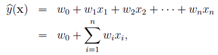

本文结合librec源代码，解析因子机的原理。

### FMSGDRecommender

参考论文:[Rendle S. Factorization machines with libfm//TITS 2012](https://dl.acm.org/citation.cfm?id=2168771)

隐因子分解机（Factorization Machine，FM）旨在解决稀疏矩阵下的特征组合问题。传统机器学习问题，一般仅考虑如何对特征赋予权重，而没有考虑特征间存在相互作用，FM模型的提出较好地解决了该问题。

传统线性回归模型基于以下模型：

传统线性回归模型没有 `\( x_i x_j \)` 的特征交叉，这样的模型不能体现特征之间的相互关系，并且由于特征空间巨大，数据稀疏性非常严重。

于是二阶多项式回归模型：

这个模型虽然有个变量之间的相互关系，但是实际操作起来有很大的问题。`\( x_i x_j \)` 表示 `\( x_i \)` 和 `\( x_j \)` 的特征组合，只有当 `\( x_i \)` 和 `\( x_j \)` 都不为0时才有意义。
由于数据稀疏性，样本中出现未交互的特征分量是普遍存在的。

为了克服上面的问题，FM的作者，借鉴了之前矩阵分解的思想，把 `\( W \)` 矩阵用 `\( V V^T \)` 表示。 `\( w_{ij} = <v_i,v_j> \)` 其中：

这是FM的核心思想。

用矩阵分解学习`\( V \)`间接学习`\( W \)`有效的降低了学习参数个数，缓解了数据稀疏问题。

通过对公式的改写和利用`\( x \)`中绝大部分数据为0，可以将复杂度降为线性复杂度。

### FMALSRecommender

参考论文:[Rendle S. Factorization machines with libfm//TITS 2012](https://dl.acm.org/citation.cfm?id=2168771)

本文参考：[Factorization Machines 学习笔记](http://blog.csdn.net/itplus/article/details/40534885)