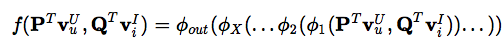
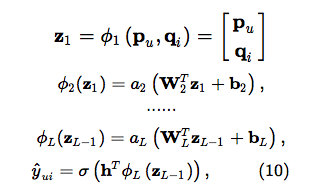
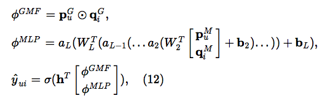

本文总结了最近的一些优秀的深度学习推荐模型。

## NCF
参考论文:[Neural Collaborative Filtering WWW17](http://delivery.acm.org/10.1145/3060000/3052569/p173-he.pdf?ip=222.195.92.10&id=3052569&acc=ACTIVE%20SERVICE&key=BF85BBA5741FDC6E%2EA4F9C023AC60E700%2E4D4702B0C3E38B35%2E4D4702B0C3E38B35&CFID=1012100955&CFTOKEN=70448875&__acm__=1512137617_57c5de515118a2d2316771b5b5b43e37)

在传统的协同过滤问题中，核心部分通过矩阵分解来建模用户和物品之间的特征交互。本文提出一种通用的神经网络框架：NCF,用神经网络取代向量相乘。

#### NCF 框架

文章首先用下图的模型展示了NCF的通用框架，首先是one-hot的稀疏输入层(Input Layer)，然后将稀疏输入映射到稠密向量(Embedding Layer),
然后将user和item的向量送入神经网络层，来学习它们之间的交互关系，(Neural CF Layers)，最后输出预测分数(Output Layer)。

 
 可表示为：
 

#### 两种NCF实例

1. 广义矩阵分解(GMF)

这个实例是用神经网络来作为广义的矩阵分解。

定义第一层Neural CF Layer为：

输出层为：

如果aout为恒等函数，hT全为1，GMF退化为MF,所以GMF为广义的矩阵分解模型。

2. 多层感知机(MLP)

定义第一层Neural CF Layer为两个向量的连接，在加上一些隐层来提高表达能力。

#### 结合GMF 和 MLP

GMF MLP 共享embeddding 会限制模型的表达能力，所以本文并没有共享，而是拥有各自的独立embedding。最后用一层神经网络来结合两个模型，并计算输出。这个结构称之为 NeuMF Layer。

本文探索了几种神经网络相关的CF方法，GMF，它应用了一个线性内核来模拟潜在的特征交互；MLP，使用非线性内核从数据中学习交互函数。但是本文的模型没有考虑辅助信息，只能建模user item之间的关系，
不适用Mutil-field类型的数据。

## NFM
参考论文:[Neural Factorization Machines for Sparse Predictive Analytics SIGIR17](http://www.comp.nus.edu.sg/~xiangnan/papers/sigir17-nfm.pdf)

NFM是对FM的拓展，用神经网络来刻画一阶，二阶和一般FM不会用到的更高阶的特征关系以及非线性的特征之间的关系，因此相对于FM理论上拥有更强的表达能力。如果使用没有隐层的NFM，理论上等价于FM。

文章认为FM模型是线性模型，原文表述为：In other words, the predicted target yˆ(x) is linear w.r.t. each model parameter [28]. Formally, for each model parame- ter θ ∈ {w0, {wi }, {vif }}, we can have yˆ(x) = д + hθ, where д and h are expressions independent of θ。

### NFM模型：

#### Embedding Layer:
每个特征对应一个Embedding，将稀疏输入转化为稠密的向量表示。

#### Bi-Interaction Layer:

输入embedding layer的embeddings, 计算两两embedding向量的element-wise product,（）即得到两两向量的交互向量。

等价于计算如下：

#### Hidden Layer:

#### Prediction Layer:

将隐层输出向量转化为预测分值。

#### 最终模型为：

所有参数为：
相对FM增加的参数为：这正是FM所不能表达的高阶特征交互关系。

## AFM
参考论文:[Rendle S. Factorization machines with libfm//TITS 2012](https://dl.acm.org/citation.cfm?id=2168771)

## Wide&Deep
参考论文:[Rendle S. Factorization machines with libfm//TITS 2012](https://dl.acm.org/citation.cfm?id=2168771)

## PNN

## DeepFM
参考论文:[Rendle S. Factorization machines with libfm//TITS 2012](https://dl.acm.org/citation.cfm?id=2168771)

