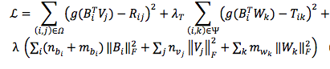

本文结合librec源代码，总结一些结合Social信息的相关推荐系统模型


### TrustMFRecommender

参考论文:[Yang B, Lei Y, Liu J, et al. Social collaborative filtering by trust[J]//IJCAI 2013.
](http://www.aaai.org/ocs/index.php/IJCAI/IJCAI13/paper/download/6750/7139)

CF方法是推荐系统非常流行的方法，但是它有数据稀疏和冷启动问题，这篇文章精巧的结合了两个稀疏数据源：
用户评分矩阵，和信任网络（trust network）。

这篇文章思想源于，用户在社交网络中的影响是相互的，比如特定用户的评分可能会受他信任的用户的影响，并且他的评分同样会影响其他信任他的用户。
为了对这种思想进行建模，作者提出，用户之间的信任关系，可以映射到向量空间之中，每个用户用两个向量来表示这种关系，分别为truster向量和trustee向量,
用户A对用户B的信任程度为w，可以用用户A的truster向量与用户B的trustee向量内积得到。

传统CF矩阵分解的方法是认为评分矩阵R 由用户因子空间U 和 物品因子空间V（本文使用这种符号）相乘得到，

通过最小化下面的损失函数由 R 得到 U V：


同样地，信任矩阵T（T_{i,j} 代表用户i 对用户j 的信任值，因为用户j 可能对用户i 的信任值不同，因此，矩阵T 不是对称的）可以由 用户信任矩阵 B 和 用户被信任矩阵 W
相乘得到。

通过最小化下面的损失函数：


这篇文章提出了三个模型：Truster Model, Trustee Model, Truster-MF，来结合上述的两个矩阵分解。

#### Truster Model

核心思想是 用矩阵 B 结合 用户因子矩阵 U 和 信任矩阵B ，从而把两个矩阵分解问题联系在一起。R 由因子空间B(同时包含用户信息因子和用户信任信息因子) 和 物品因子空间V 相乘得到，
信任矩阵T 由 用户信任矩阵 B（同时包含用户信息因子和用户信任信息因子） 和 用户被信任矩阵 W 相乘得到。
通过最小化下面的损失，得到 B V W：


因为信任矩阵T的取值在[0,1]之间，为了更好地学习模型，这篇文章把R做了正则化处理，也限制在了[0,1]之间，本文没有采取线性放缩，而是采取了logistic function(也具有保证在[0,1]之间的性质)(下式中的g)，因此最小化损失模型变为：



#### Trustee Model

思想与Truster Model 相同，只不过W取代了B在上述模型的位置，最小化下面的损失：


#### Truster-MF

是上述两种模型的结合，先独立训练上述两个模型，然后按照下述公式进行结合；


总结：

这个模型可以从用户的社会行为学习用户的偏好（不只是从评分行为），Truster Model学到了，用户在评分是受别人的影响，Trustee Model学到了，用户的评分对别人的影响，Truster-MF把两者结合，试图给两个用户群都提供高质量的推荐。

librec提供了这三种模型的选择，在predict()函数中可以清楚的看到：

```java
    switch (model) {
        case "Tr":
            predictRating = DenseMatrix.rowMult(trusterUserTrusterFactors, userIdx, trusterItemFactors, itemIdx);
            break;
        case "Te":
            predictRating = DenseMatrix.rowMult(trusteeUserTrusteeFactors, userIdx, trusteeItemFactors, itemIdx);
            break;
        case "T":
        default:
            DenseVector userVector = trusterUserTrusterFactors.row(userIdx).add(trusteeUserTrusteeFactors.row(userIdx, false));
            DenseVector itemVector = trusterItemFactors.row(itemIdx).add(trusteeItemFactors.row(itemIdx, false));
            predictRating = userVector.inner(itemVector) / 4;
    }
```

在代码中可以清晰看到，Truster-MF模型是独立训练两个模型

```java
    protected void trainModel() throws LibrecException {
        switch (model) {
            case "Tr":
                TrusterMF();
                break;
            case "Te":
                TrusteeMF();
                break;
            case "T":
            default:
                TrusterMF();
                TrusteeMF();
        }
    }
```


